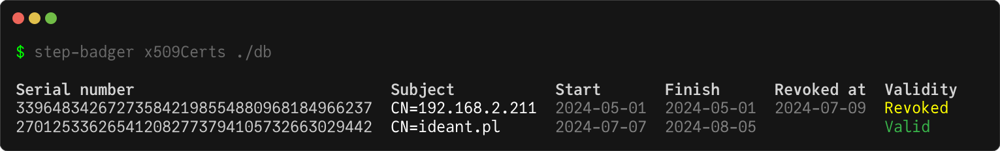
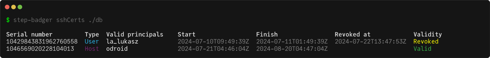
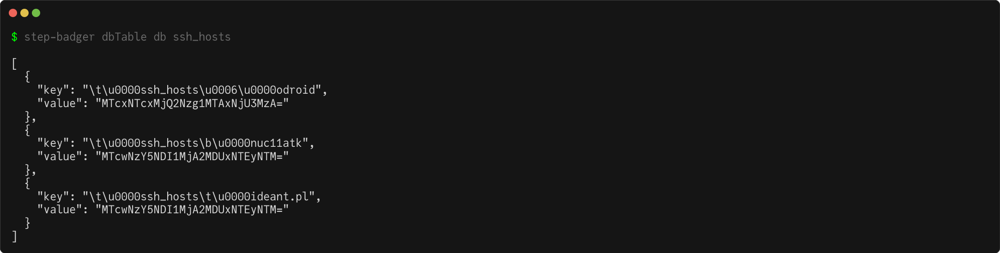

<div align="center">
    
</div>
<div align="center">
    by Qwen3.8-27B-UD-Q8.
</div>

---

# step-badger [](https://hits.sh/github.com/lukasz-lobocki/step-badger/) 

This tool has 3 features:

- display issued [x509 certificates](#step-badger-x509certs) from [step-ca](https://github.com/smallstep/certificates) [badger](https://github.com/dgraph-io/badger) database.
- display issued [ssh certificates](#step-badger-sshcerts) from [step-ca](https://github.com/smallstep/certificates) [badger](https://github.com/dgraph-io/badger) database.
- display [content of a given data bucket](#step-badger-dbtable) from [step-ca](https://github.com/smallstep/certificates) [badger](https://github.com/dgraph-io/badger) database.

## step-badger x509Certs

Export data of x509 certificates.

```bash
step-badger x509Certs PATH [flags]
```

```text
Flags:
  -v, --valid                                      valid certificates shown (default true)
  -r, --revoked                                    revoked certificates shown
  -e, --expired                                    expired certificates shown
      --emit {table|json|markdown|openssl|plain}   emit format: table|json|markdown|openssl|plain (default table)
      --time {iso|short}                           time format: iso|short (default iso)
      --sort {start|finish}                        sort order: start|finish (default finish)
      --serial {dec|hex}                           serial format: dec|hex (default dec)
      --dnsnames                                   dns names column shown
      --emailaddresses                             email addresses column shown
      --ipaddresses                                ip addresses column shown
      --uris                                       uris column shown
      --issuer                                     issuer column shown
      --crl                                        crl column shown
      --provisioner                                provisioner column shown
      --algorithm                                  signature algorithm column shown
```

### Example



## step-badger sshCerts

Export data of ssh certificates.

```bash
step-badger sshCerts PATH [flags]
```

```text
Flags:
  -v, --valid                              valid certificates shown (default true)
  -r, --revoked                            revoked certificates shown
  -e, --expired                            expired certificates shown
      --emit {table|json|markdown|plain}   emit format: table|json|markdown|plain (default table)
      --time {iso|short}                   time format: iso|short (default iso)
      --sort {start|finish}                sort order: start|finish (default finish)
      --serial {dec|hex}                   serial format: dec|hex (default dec)
      --type                               host type column shown (default true)
      --keyid                              key id column shown
      --algorithm                          signature algorithm column shown
```

### Example



## step-badger dbTable

Export data of a given bucket.

```bash
step-badger dbTable PATH BUCKET
```

> See [this](https://github.com/smallstep/certificates/blob/077f688e2d781fa12fd3d702cfab5b6f989a4391/db/db.go#L18) for bucket names.

### Example



## Info

### Badger single-user limitation

As a workaround, copy the badger database directory `db/` to some other temporary location. Stopping with `systemctl stop step-ca` is not required, you can do it on live running CA. Then, run `step-badger` against this temporary copy.

Simplified example. Adjust paths to your environment.

```bash
source_location='/etc/step-ca/db'
destination_location='/var/log/step-ca'
cp --recursive --force "${source_location}" "${destination_location}"
step-badger sshCerts "${destination_location}/db"
```

### Other

See [this](https://smallstep.com/docs/step-ca/certificate-authority-server-production/#enable-active-revocation-on-your-intermediate-ca).

## Build

See [BUILD.md](BUILD.md) file.

## Testing

Run the unit tests:

```bash
go test ./... -race -count=1
```

The golden tests (`cmd/golden_test.go`) additionally run `sshCerts -e -r --emit=json` and `x509Certs -e -r --emit=json` against the step-ca badger database snapshot at `db/` and compare the output with the golden files in `test_results/`. The `Validity` field is excluded from the comparison because it depends on the current time. Both fixtures are git-ignored, so these tests skip cleanly when they are absent (e.g. in CI) and run fully on a machine where the snapshot exists.

To regenerate the golden files, copy the database first (see [Badger single-user limitation](#badger-single-user-limitation)) and redirect the output:

```bash
cp --recursive ./db /tmp/step-badger-db
go build -o bin/step-badger .
bin/step-badger sshCerts  -e -r --emit=json /tmp/step-badger-db > test_results/sshCerts.json
bin/step-badger x509Certs -e -r --emit=json /tmp/step-badger-db > test_results/x509Certs.json
```

## License

`step-badger` was created by Lukasz Lobocki. It is licensed under the terms of the CC0 v1.0 Universal license.

All components used retain their original licenses.

## Credits


1. `step-badger` was created with [cookiecutter](https://cookiecutter.readthedocs.io/en/latest/) and [template](https://github.com/lukasz-lobocki/go-cookiecutter).
1. Inspired by [github.com/maraino](https://gist.github.com/maraino/4dcb64cb051b17ef6d421892cb4e55a8#file-listcerts-go).
1. Coding skills by [github.com/samber/cc-skills-golang](https://github.com/samber/cc-skills-golang).
