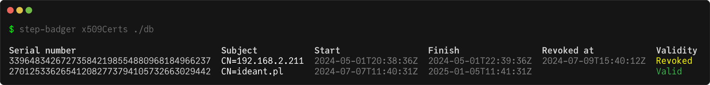
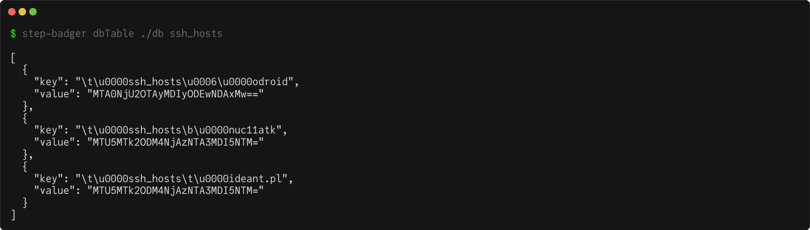

# step-badger 

This tool has 3 features:

- display issued [x509 certificates](#step-badger-x509certs) from step-ca badger database.
- display issued [ssh certificates](#step-badger-sshcerts) from step-ca badger database.
- display [content of a given data prefix](#step-badger-dbtable) from step-ca badger database.

## step-badger x509Certs

Export data of x509 certificates.

```bash
step-badger x509Certs PATH
```

### Example



## step-badger sshCerts

Export data of ssh certificates.

```bash
step-badger sshCerts PATH
```

### Example


## step-badger dbTable

Export data of a given table.

```bash
step-badger dbTable PATH TABLE
```

### Example



## Build

See [BUILD.md](BUILD.md) file.

## License

`step-badger` was created by Lukasz Lobocki. It is licensed under the terms of the CC0 v1.0 Universal license.

All components used retain their original licenses.

## Credits

`step-badger` was created with [cookiecutter](https://cookiecutter.readthedocs.io/en/latest/) and [template](https://github.com/lukasz-lobocki/go-cookiecutter).
